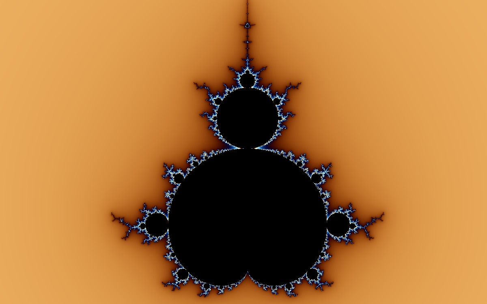

<!-- BEGIN GENERATED public-project -->

# FractalPark

FractalPark is an open-source, formula-first fractal knowledge and creation platform with published formula source you can read and run, plus a distinct Classic-compatible formula editor.



**[Open Explore](https://www.fractalpark.com/en/explore) · [Browse the Formula Atlas](https://www.fractalpark.com/en/formulas) · [Read the FRM Guide](https://www.fractalpark.com/en/formulas/frm) · [Visit the Gallery](https://www.fractalpark.com/en/gallery)**

Read pinned source for 534 published Standard Definitions. [Open the Standard Formula directory](https://www.fractalpark.com/en/formulas/directory).

## Available today

- **Discover formulas** — Browse the Formula Atlas: 534 published Standard Definitions across 7 structural families, of which 94 also belong to the Classic collection, with 21 in-depth Formula Guides covering the math, history, and visual character of the classics.
- **Create in the browser** — Explore and render in real time with WebGL: Mandelbrot mode across the 534 published Standard Definitions, Julia mode where supported, 7 transforms, 9 coloring modes, gradients, lighting, and keyframe animation.
- **Learn FRM and write custom formulas** — Write custom formulas in FractalPark's tested Classic-compatible FRM subset with the Guide and standalone Editor: AST validation, live GLSL preview, and clear diagnostics.
- **Save and share** — Save artworks and custom formulas to your private cloud with email sign-in and pick them up on any device, publish pieces to the community gallery, or create anonymously and export high-resolution PNG images up to 4× with SSAA anti-aliasing.

## Current boundaries

- Published Standard Definitions use FRM-like v1 source. The standalone Editor uses a separate, practical Classic-compatible subset — not a complete Fractint reimplementation.
- Creating needs no account. Saving artworks and formulas uses email one-time-code sign-in and stores them in your private cloud library; publishing is always explicit, and artworks carrying a custom formula publish its source under the MIT license.
- The interface is available in seven languages: English, Simplified Chinese, Portuguese, Korean, Russian, Spanish, and French.

On the roadmap (not released):

- Working to bring Fractint’s historical formula archive into the modern browser over time.
- Deeper coloring, animation, and zoom capabilities are on the roadmap but not released.

FractalPark is released under the [MIT License](https://opensource.org/license/mit).

<!-- END GENERATED public-project -->

## Getting Started

```bash
git clone https://github.com/noodle-bag/fractalpark.git
cd fractalpark
npm install
npm run dev
```

Open `http://localhost:3000` in your browser.

## Scripts

```bash
npm run dev       # Start the development server
npm run build     # Create a production build
npm run start     # Start the production server
npm run lint      # Run ESLint
npm run test:run  # Run Vitest once
```

## Project Layout

```text
docs/              Architecture specifications, ADRs, and release test plans
messages/          UI translations
public/            Static assets and gallery preset data
src/app/           Next.js routes
src/components/    React UI components
src/engine/        WebGL rendering engine and shader assembly
src/hooks/         React hooks for renderer, gallery, animation, and UI state
src/lib/           Shared utilities
src/test/          Vitest tests
tests/e2e/         Playwright smoke tests
```

## Architecture and Specifications

See the [documentation index](docs/README.md) for the durable Document format,
cross-surface content model, architecture decisions, and active release
regression plans.

## License

FractalPark is released under the MIT License. See [LICENSE](LICENSE).
